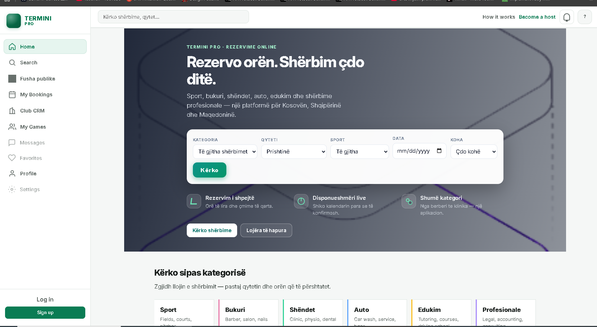
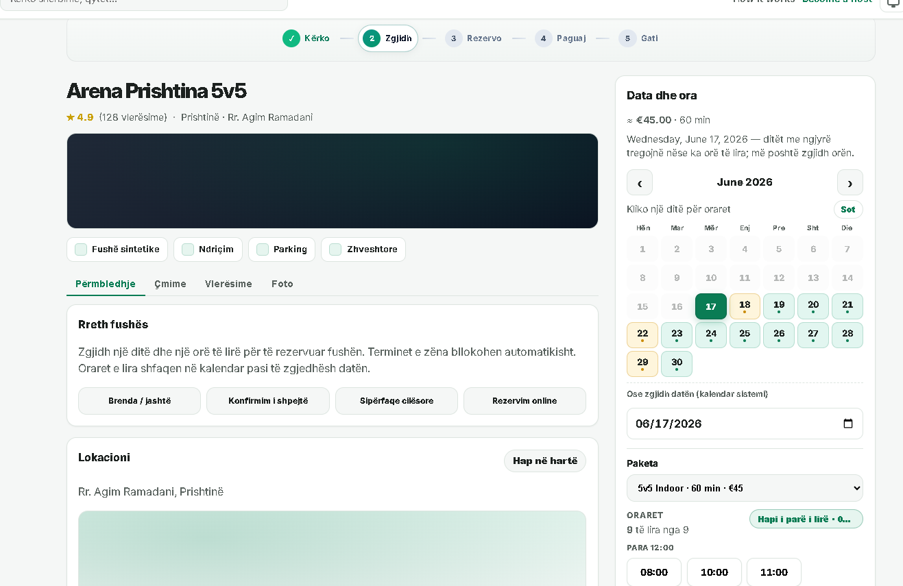
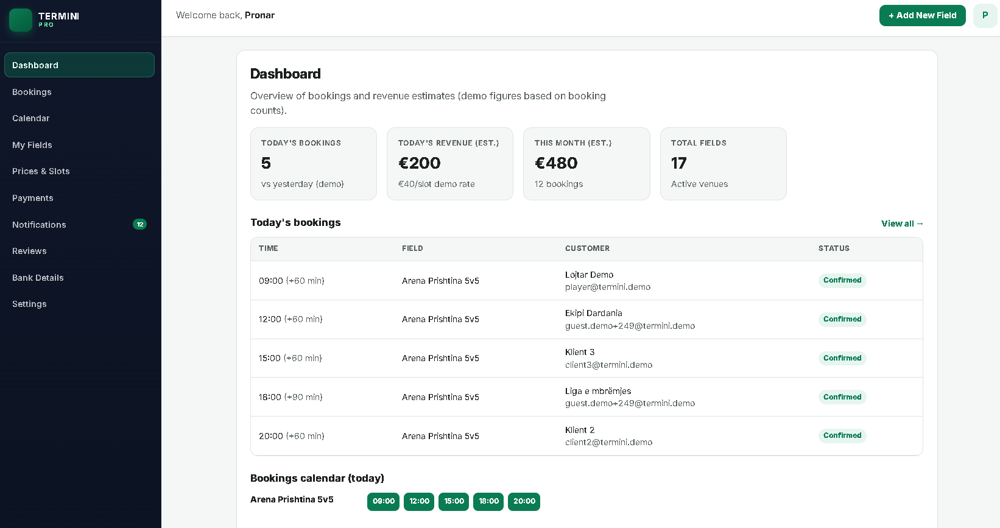

## Termini

An **online booking platform** for time-based services — sports fields, salons, clinics, and more. Built with **Spring Boot** (backend) and **React + Vite** (frontend).

### Who it's for

| Role | Description |
|------|-------------|
| **User** | Browse services, book slots, pay, join public matches |
| **Field owner** | Manage venues, calendar, prices, bookings, and notifications |
| **Admin** | Platform overview and summary metrics |

### Services & features

#### Bookings & calendar
- Create and manage appointments with **overlap prevention**
- Daily time slots (08:00–23:00) and **monthly calendar** per venue
- Service offers with pricing
- User booking history (`/bookings`)
- **Recurring bookings** — templates expanded automatically by a scheduler

#### Service catalog (multi-category)
Bookable categories:
- **Sports** — fields, courts, pitches
- **Beauty** — barber, salon, nails
- **Health** — clinic, physio, dental
- **Auto** — car wash, service, tyres
- **Education** — tutoring, courses
- **Professional** — legal, accounting, consulting
- **Other** — any bookable location

Filters: city, sport type, time of day, region (Kosovo, Albania, North Macedonia).

#### Public outdoor fields
- Dedicated section for public outdoor venues (`/fusha-publike`)

#### Open matches & players (sports)
- Turn a booking into a **public match** and seek extra players
- Browse open matches (`/matches`)
- Join a match and split cost preview
- **Leaderboard** and player stats

#### Authentication & security
- User register / login
- Owner register / login
- **JWT** + Spring Security with role-based access (`USER`, `FIELD_OWNER`, `ADMIN`)

#### Payments
- Online checkout (**MOCK** mode for local dev)
- Stripe integration scaffold (`STRIPE_STUB`) for future production use
- Configurable platform fee
- Payment completion page

#### Owner panel (`/owner`)
- Dashboard, venues, calendar, bookings (list + detail)
- Notification inbox with unread count
- Bank / payout profile (IBAN)
- Price and slot management
- *Placeholder pages: Payments, Reviews, Settings*

#### B2B & clubs
- **Companies** — create a company, add members, **bulk bookings**
- **Club CRM** — create clubs, manage members and subscription plans

#### Real-time & admin
- **WebSocket** (STOMP) for live updates
- Owner notifications on new bookings
- Admin summary dashboard (`/admin`)

#### Developer experience
- REST API with **OpenAPI / Swagger UI**
- Demo data seeding for local testing (see [Configuration](#configuration))

### Screenshots

| Home | Booking | Owner dashboard |
|------|---------|-----------------|
|  |  |  |

Screenshots are from the static UI prototype (`Termini/termini.html`). Replace with live app captures after running locally.

### Tech stack

| Layer | Technologies |
|-------|--------------|
| Backend | Java 17, Spring Boot 3, Spring Data JPA, Spring Security, Liquibase, WebSocket |
| Frontend | React 19, TypeScript, Vite, React Router |
| Database | PostgreSQL 16 (Docker) |
| API docs | springdoc-openapi (Swagger UI) |

### Project structure

```
termini/                      # repository root
├── README.md
├── Termini/                  # Spring Boot backend
│   ├── frontend/             # React app
│   ├── docker-compose.yml    # Postgres for local dev
│   ├── src/main/java/        # controllers, services, entities
│   └── src/main/resources/   # application.properties, changelogs
```

### Prerequisites

- **Java 17** (or newer)
- **Docker Desktop** (recommended for Postgres)
- **Node.js 18+** and **npm** (for the frontend)
- **Git**

### Setup & running locally

#### 1. Clone the repository

```bash
git clone https://github.com/samikeka/termini.git
cd termini
```

#### 2. Start the database (Postgres)

```bash
cd Termini
docker compose up -d
```

Default connection (matches `application.properties`):

| Setting | Value |
|---------|-------|
| Host | `localhost:5432` |
| Database | `termini` |
| User | `termini_user` |
| Password | `termini_pass` |

#### 3. Start the backend

From `Termini/`:

```bash
./mvnw spring-boot:run
```

On Windows:

```bash
./mvnw.cmd spring-boot:run
```

Backend: **http://localhost:8080**

On first start, demo data is seeded automatically (users, fields, sample bookings). See [Configuration](#configuration) to disable or reset.

#### 4. Start the frontend

In a second terminal:

```bash
cd Termini/frontend
npm install
npm run dev
```

Frontend: **http://localhost:5173**

#### 5. Explore the API

With the backend running:

- Swagger UI: **http://localhost:8080/swagger-ui/index.html**
- WebSocket endpoint: `ws://localhost:8080/ws`

### Configuration

Main settings: `Termini/src/main/resources/application.properties`

**Environment variables** (recommended for production):

| Variable | Description |
|----------|-------------|
| `TERMINI_DB_URL` | JDBC URL (default: `jdbc:postgresql://localhost:5432/termini`) |
| `TERMINI_DB_USERNAME` | Database user |
| `TERMINI_DB_PASSWORD` | Database password |
| `TERMINI_JWT_SECRET` | JWT signing secret (min. 32 characters) |

**Demo data** (development only):

| Property | Default | Description |
|----------|---------|-------------|
| `termini.demo-data.seed` | `true` | Seed demo users and venues on startup |
| `termini.demo-data.force` | `false` | Re-seed even when DB is not empty |
| `termini.demo-data.reset` | `false` | Clear demo data before seeding |

**Payments:**

| Property | Default | Description |
|----------|---------|-------------|
| `termini.payments.checkout-mode` | `MOCK` | `MOCK` or `STRIPE_STUB` |
| `termini.payments.platform-fee-percent` | `0` | Platform commission (%) |

### Running tests

From `Termini/`:

```bash
./mvnw test
```

Tests use an in-memory H2 database (no Docker required).

### Roadmap / work in progress

| Feature | Status |
|---------|--------|
| Real Stripe payments | Stub only |
| Owner: Payments, Reviews, Settings | UI placeholders |
| Liquibase migrations | Present but disabled (`spring.liquibase.enabled=false`) |
| Multi-tenancy | Not implemented (data scoped by `owner_id`) |

### License

This project is licensed under the **MIT License** — see [LICENSE](LICENSE).

You may clone, use, modify, and distribute the code freely, as long as you include the original copyright notice.
